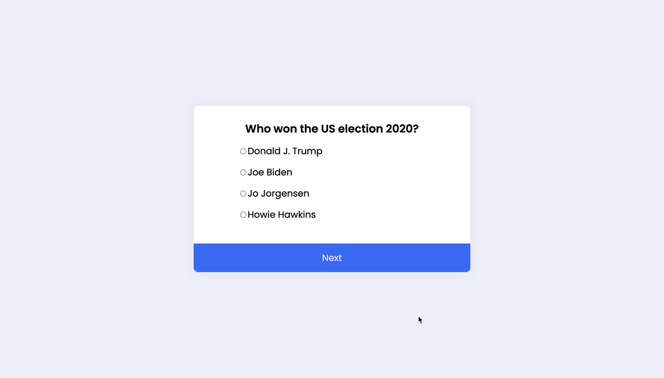
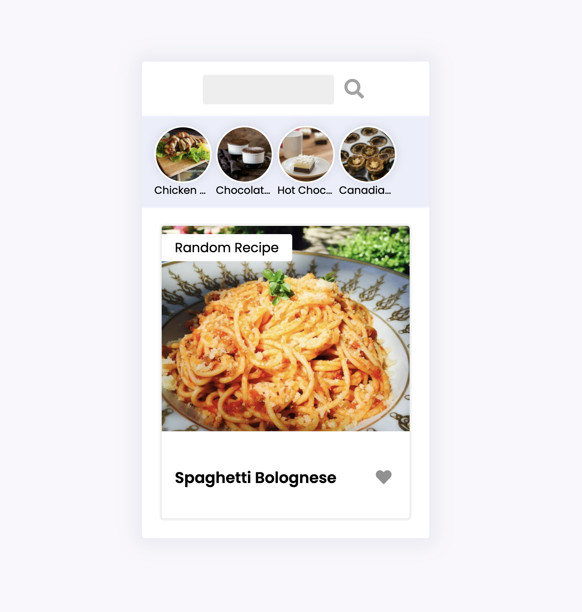

# 10 JS projects in 10 hours challenge
> Base on Florin Pop's "10 JavaScript Projects in 10 Hours" [YouTube video](https://youtu.be/dtKciwk_si4)

1. Countdown Timer
- Design: [Countdown Timer](https://uidesigndaily.com/posts/sketch-countdown-timer-day-876)
- Screenshot

2. Quiz app
- Design: [Questionnaire](https://uidesigndaily.com/posts/sketch-questionnaire-choice-submit-day-924)
- Screenshot

3. Recipe app
- Design: [Recipe App](https://uidesigndaily.com/posts/sketch-recipe-app-food-mobile-day-615)
- Screenshot

3. Notes app
- Design: [Notes Widget](https://uidesigndaily.com/posts/photoshop-notes-widget-day-65)
- Screenshot

4. ToDo app
- Design: [todos](http://todomvc.com/examples/react/#/)
- Screenshot
